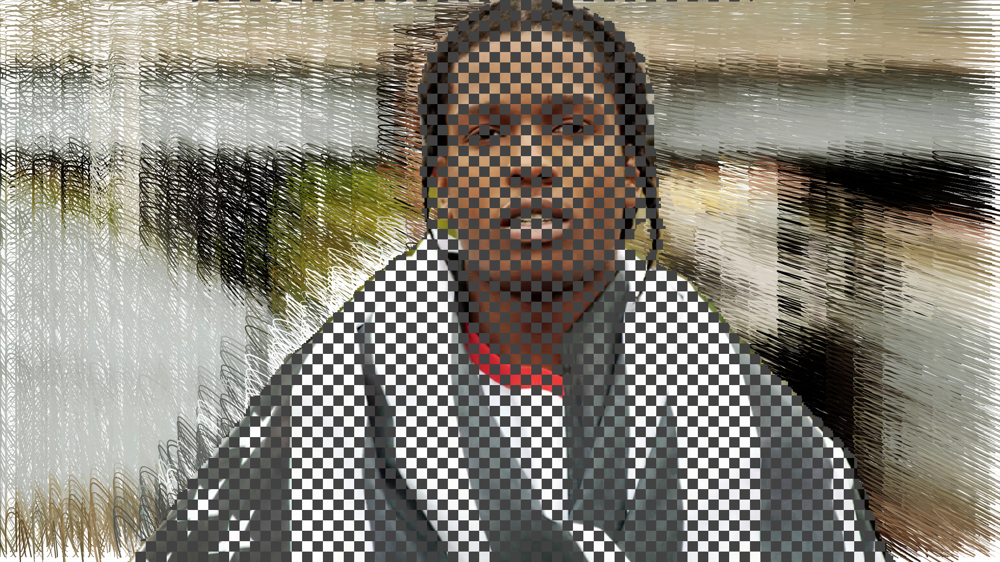
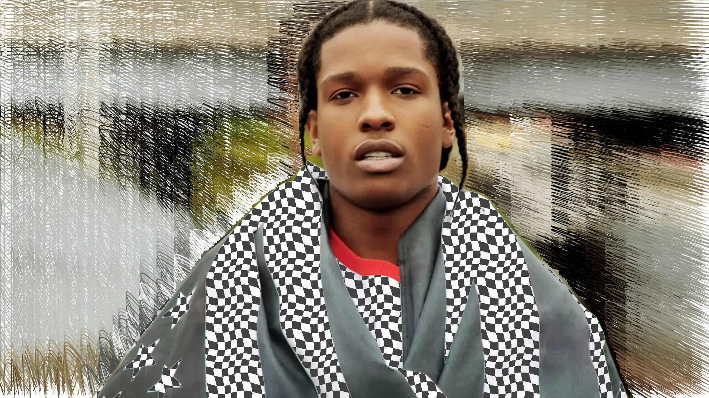
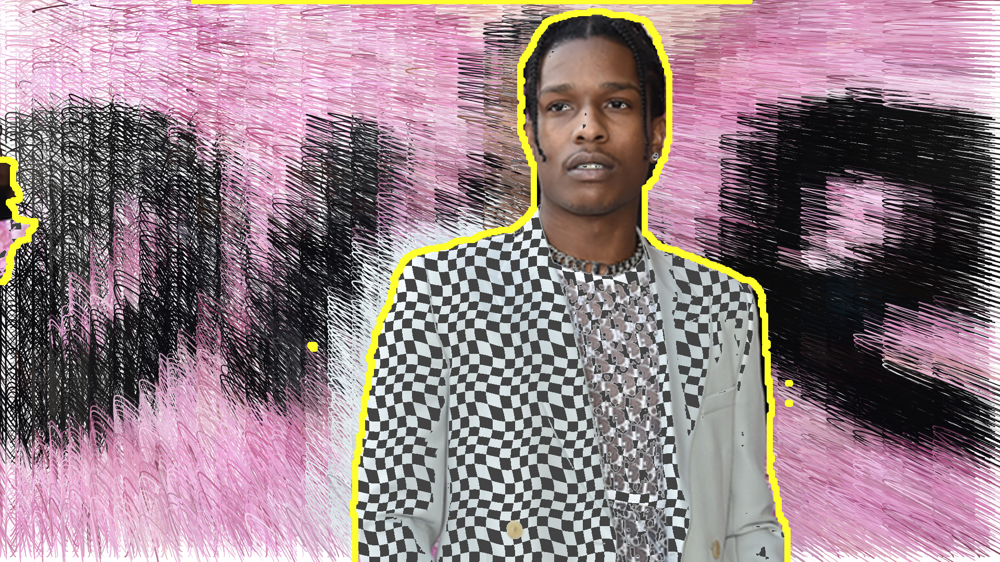
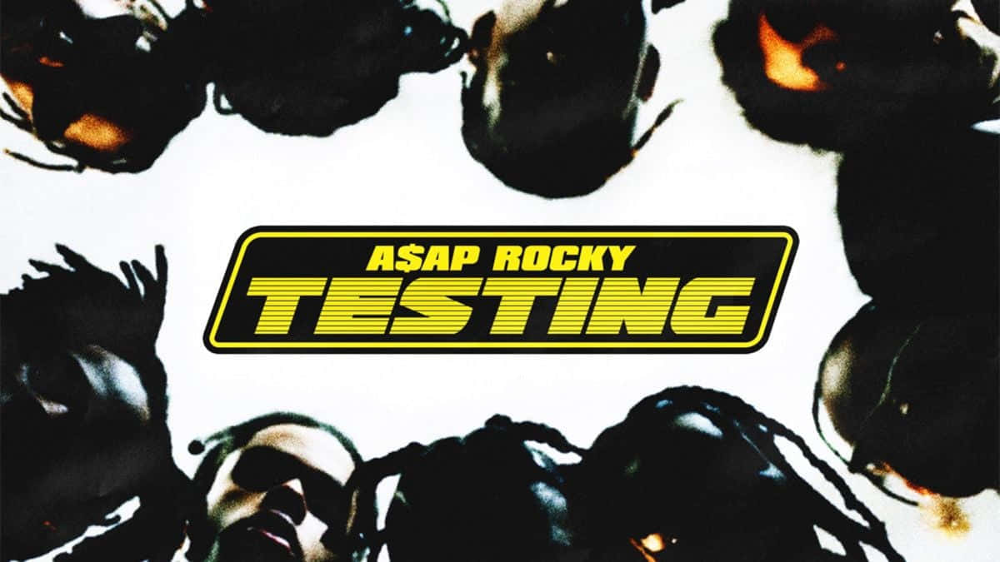

## Creative Coding 2: Custom Pixel

# Training 

Initially, I had numerous issues with training my images. However, this was mainly due to my masks being inverted. This challenge might have been beneficial, as it prompted me to be more selective with my photos. I chose to focus on a single individual rather than multiple people. The output of my test image was commendable, with most imperfections being rectified through software. Nonetheless, some imperfections weren't feasible to address due to software limitations, particularly when considering performance.

# Design

My final result was closely aligned with my initial vision but with some enhancements:

1. **Blur Effect**: I refined the blur effect to align with my concept of portraying a chaotic world around someone. I'm quite pleased with the result. The randomised rendering provides a fresh effect with every new image. [See sketch.js lines 117-134](https://github.com/23-2-DSDN242/mddn-242-data-mapping-Jeve-Sobs/blob/main/sketch.js#L117-L134).
2. **Subject Highlight**: I accentuated my subject to emphasise that they were the focal point of the image. [See sketch.js lines 52-72](https://github.com/23-2-DSDN242/mddn-242-data-mapping-Jeve-Sobs/blob/main/sketch.js#L52-L72).
3. **Checkerboard Pattern**: Initially, I introduced a checkerboard pattern as a simple test. But I grew fond of how it appeared over the lighter segments of the image. I set the pattern to render only on areas of the image that exceeded a certain brightness, creating an intriguing effect. [See sketch.js lines 26-50](https://github.com/23-2-DSDN242/mddn-242-data-mapping-Jeve-Sobs/blob/main/sketch.js#L26-L50).
   
   

   Once I realised the image appeared rather flat and considering that the white sections of my test image were the subject's attire, I decided to distort the checkerboard to simulate its presence on the clothing. This improvised effect turned out much better than anticipated, considering the checkerboard was just a proof of concept.

   

   

# Technical 

When applying the blur effect the curves were overlapping the object so I created another method to manually override to mask pixels to set them back to the source image as seen here [See sketch.js lines 136-148](https://github.com/23-2-DSDN242/mddn-242-data-mapping-Jeve-Sobs/blob/main/sketch.js#L136-L148). I used random numbers to add variations in the line thickness and direction to give it a more messy appearance. 

For the outline, I looped through the mask pixels to identify pixels that belonged to the mask object. Then, I examined all four neighbouring pixels to ascertain if they were part of the mask. If any weren't part of the mask, I rendered a point at the original pixel's position. This looked good for my training images as the masks were pretty close to perfect however with my testing images there were random parts of the images that were masks which resulted in random yellow lines. Initially, I thought I would find more testing images but after looking at the example template images I noticed a similar thing. Most of the example images and my images had a line at the top of the screen. 
 
I managed to correct this by making a smart outline method which took the far surrounding pixels into consideration when determining whether a pixel should be an outline. [See sketch.js lines 75-98](https://github.com/23-2-DSDN242/mddn-242-data-mapping-Jeve-Sobs/blob/main/sketch.js#L75-L98). It only started checking the surrounding pixels after the first 10 pixels had been plotted to start each line. I had to start the search from the bottom of the images and work up to not detect the line at the top as a valid line. 

Here is the effect after using the smart outline method 

 

# Final Image 

I created my final image entirely using HTML and CSS, this was inspired by A$AP Rocky's album “Testing”

